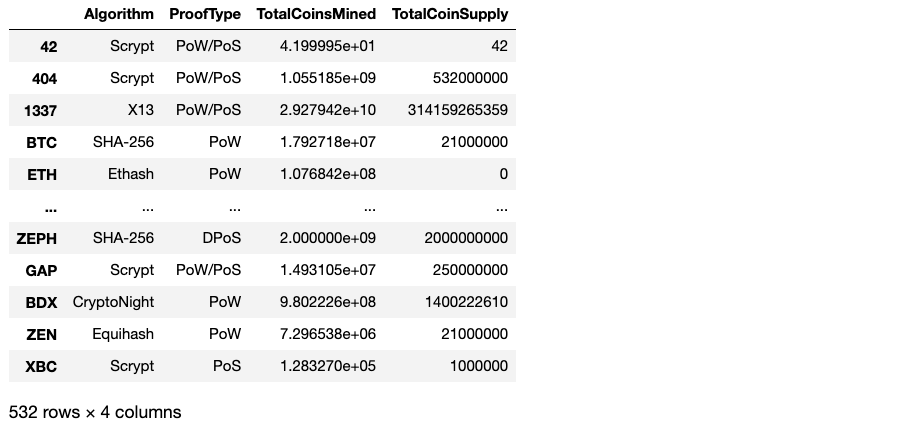
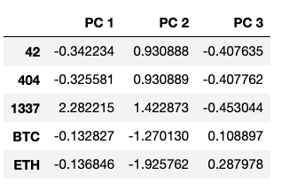
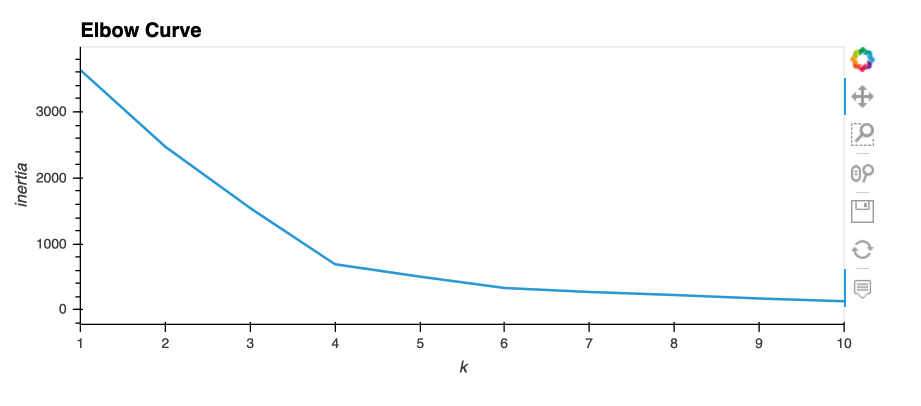
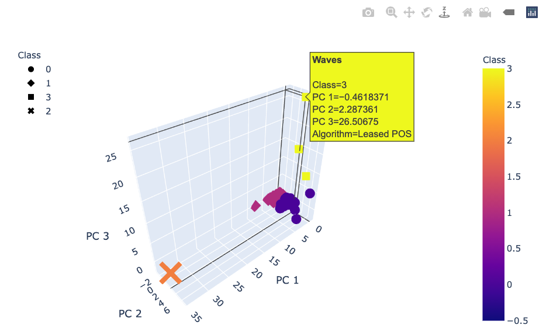
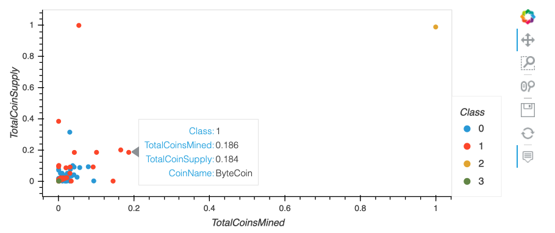

# Cryptocurrencies

## Overview

In this project, we utilized unsupervised machine learning algorithms to explore data which we were not sure what outcome we were looking for. Our goal was to create a report that included what cryptocurrencies were on the trading market and how they could be grouped to create a classification system for the new investment.

The following tasks were done:

- Process the data for Principal component analysis (PCA).
- Reduce data dimensions using PCA.
- Cluster cryptocurrencies using K-means.
- Visualize cryptocurrencies results.

## Resources

- Data Source: crypto_data.csv (https://min-api.cryptocompare.com/data/all/coinlist)
- Software: Python 3.8.5, Anaconda 4.10.1

## Results

### Process the data

The criteria for filtering our original data were as follows:

- Keep all the cryptocurrencies that are being traded.
- Remove rows that have at least one null value.
- Keep rows where coins have been mined.
- Standardize the data.

Our final sample contained 532 data:

### Reduce data dimensions using PCA

By using the PCA algorithm, we reduced the dimensions to three principal components and placed them in a new DataFrame. The head of the DataFrame was shown as follows:

### Cluster cryptocurrencies using K-means

The elbow curve to find the best value of K:

### Visualize cryptocurrencies results

The 3D scatter plot to plot the three clusters:

The scatter plot with x="TotalCoinsMined", y="TotalCoinSupply":

